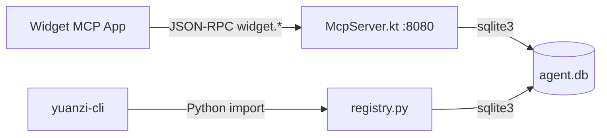
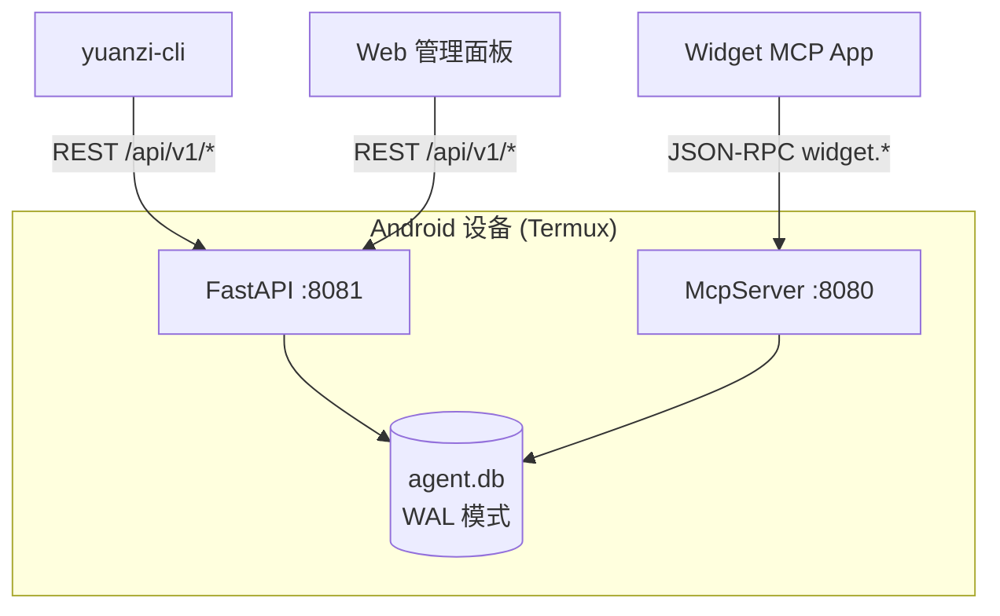

# M4 注册中心服务化 — 架构设计文档

> **状态**: `📐 design-ready`
> **作者**: Arch
> **日期**: 2026-07-18
> **依赖**: M4.1 Schema 迁移系统 ✅

---

## 1. 需求概述

将注册中心从本地 Python 函数调用升级为可通过 HTTP 访问的服务，使 CLI、Web 面板、第三方工具都能查询原子数据。

### 功能需求
- F1: 原子列表查询（分页/过滤/排序）
- F2: 原子详情查询（完整注册信息）
- F3: 统计总览
- F4: 健康检查端点
- F5: 原子版本历史记录（M4.2 前置）

### 非功能需求
- N1: 与现有 McpServer（端口 8080）共存，不破坏向后兼容
- N2: Termux 环境可运行（低内存、无 Docker）
- N3: 响应时间 < 50ms（SQLite 本地查询）

---

## 2. 现状分析



**痛点**:
- 无 HTTP 查询接口，外部系统无法访问
- `registry.py` 的函数接口是 Python-only
- 无分页，全量返回 61 条记录
- 无健康检查，运维不可见

---

## 3. 目标架构



**关键决策**: FastAPI 与 McpServer 共存，共享 SQLite。WAL 模式避免读写冲突。

---

## 4. API 契约

### 4.1 原子列表

```
GET /api/v1/atoms?status=registered&category=Database&search=postgres&page=1&size=20&sort=name&order=asc

Response 200:
{
  "total": 7,
  "page": 1,
  "size": 20,
  "pages": 1,
  "items": [
    {
      "atom_id": "mcp.postgres",
      "name": "Postgres",
      "version": "1.0.0",
      "description": "...",
      "alias": ["postgres", "postgresql"],
      "classification": {
        "category": "Database",
        "maturity": "stable",
        "tags": ["mcp", "database"]
      },
      "lifecycle": {
        "status": "registered",
        "created_at": "2026-07-17T19:24:29Z",
        "registered_at": "2026-07-17T19:24:29Z"
      },
      "purpose": {
        "summary": "PostgreSQL database operations",
        "function_count": 7
      },
      "signature": "de5ed413bd72..."
    }
  ]
}
```

**Query Parameters**:
| 参数 | 类型 | 默认 | 说明 |
|------|------|------|------|
| status | string | - | registered/running/offline/deprecated |
| category | string | - | 分类过滤 |
| search | string | - | 关键词搜索 atom_id/name/alias |
| maturity | string | - | stable/beta/alpha/experimental |
| page | int | 1 | 页码 |
| size | int | 20 | 每页数量(max 100) |
| sort | string | name | name/atom_id/registered_at |
| order | string | asc | asc/desc |

### 4.2 原子详情

```
GET /api/v1/atoms/mcp.postgres

Response 200:
{
  "atom_id": "mcp.postgres",
  "name": "Postgres",
  "version": "1.0.0",
  "description": "...",
  "purpose": {
    "summary": "...",
    "detail": "...",
    "functions": [
      {"name": "query", "description": "Execute SQL", "input_schema": {...}, "output_schema": {...}}
    ]
  },
  "architecture": {
    "type": "mcp-server",
    "runtime": "python3.10+",
    "interface": "std-atom-http-v1",
    "state": "stateless",
    "execution": "async",
    "dependencies": [],
    "hosting": "docker"
  },
  "ownership": {
    "author": "mcp-main",
    "maintainer": "Yuanzi Registry",
    "license": "MIT"
  },
  "classification": {"category": "Database", "domain": "mcp", "maturity": "stable", "tags": [...]},
  "compliance": {"security_level": "internal", "data_sensitivity": "low", ...},
  "quality": {"test_status": "untested", "documentation_level": "basic"},
  "runtime": {"endpoint": "http://127.0.0.1:8080/mcp/mcp.postgres", ...},
  "lifecycle": {"status": "registered", "created_at": "...", "registered_at": "..."},
  "signature": {"hash": "de5ed413bd72...", "algorithm": "sha256"}
}
```

### 4.3 统计总览

```
GET /api/v1/stats

Response 200:
{
  "total_atoms": 61,
  "status_counts": {"registered": 61, "submitted": 0, "running": 0, ...},
  "category_counts": {"Integration": 20, "Cloud & Storage": 13, ...},
  "schema_version": "002_add_meta",
  "generated_at": "2026-07-18T..."
}
```

### 4.4 健康检查

```
GET /api/v1/health

Response 200:
{
  "status": "ok",
  "db_connected": true,
  "atom_count": 61,
  "schema_version": "002_add_meta",
  "uptime_seconds": 86400.0
}
```

---

## 5. M4.2 前置：原子版本化表

### 数据模型

```sql
CREATE TABLE IF NOT EXISTS atom_versions (
    id              INTEGER PRIMARY KEY AUTOINCREMENT,
    atom_id         TEXT NOT NULL REFERENCES atom_registry(atom_id),
    version         TEXT NOT NULL,          -- semver "1.2.0"
    signature_hash  TEXT NOT NULL,          -- 该版本的签名
    content_hash    TEXT NOT NULL,          -- 该版本的能力指纹
    changelog       TEXT,
    purpose_json    TEXT NOT NULL,
    created_by      TEXT,
    created_at      TEXT NOT NULL,
    UNIQUE(atom_id, version)
);
```

### 版本 bump 规则

| 变更 | bump | 说明 |
|------|------|------|
| 描述/标签/别名修改 | patch (1.0.0→1.0.1) | 不影响能力指纹 |
| 函数新增/修改 schema | minor (1.0.0→1.1.0) | content_hash 变化 |
| 架构类型/运行时变更 | major (1.0.0→2.0.0) | 破坏性变更 |

### 版本 API

```
GET /api/v1/atoms/{atom_id}/versions

Response 200:
{
  "atom_id": "mcp.postgres",
  "current_version": "1.2.0",
  "versions": [
    {"version": "1.2.0", "signature": "...", "created_at": "...", "changelog": "..."},
    {"version": "1.1.0", "signature": "...", "created_at": "..."},
    {"version": "1.0.0", "signature": "...", "created_at": "..."}
  ]
}
```

---

## 6. 模块结构

```
mcp-yuanzi-bridge/
├── api.py                     ← 新建: FastAPI 应用入口
├── api/
│   ├── __init__.py
│   ├── deps.py                ← DB 连接依赖注入
│   ├── schemas.py             ← Pydantic 模型
│   └── routes/
│       ├── __init__.py
│       ├── atoms.py           ← /api/v1/atoms
│       ├── stats.py           ← /api/v1/stats
│       └── health.py          ← /api/v1/health
├── migrations/
│   └── 003_atom_versions.py   ← M4.2 迁移
├── registry.py                ← 已有（复用）
└── start_yuanzi_termux.sh     ← 修改（新增 uvicorn 启动）
```

---

## 7. 技术选型

| 维度 | 选择 | 理由 |
|------|------|------|
| 框架 | FastAPI + uvicorn | Pydantic v2 支持，自动 OpenAPI 文档，CLI 已有 pydantic 依赖 |
| 端口 | **8081** | 8080 已被 McpServer 占用 |
| 数据库 | 共享 `agent.db` (WAL) | 避免数据隔离，读多写少无冲突 |
| 认证 | 无（M6 再加） | M4 阶段目标是查询 API，无需认证 |

---

## 8. 实施子任务

| # | 任务 | 依赖 | 预估 |
|---|------|------|------|
| M4.2a | 迁移 003: atom_versions 表 | M4.1 ✅ | 30 min |
| M4.2b | registry.submit_atom() 自动记录版本 | M4.2a | 30 min |
| M4.3a | api/schemas.py Pydantic 模型 | 无 | 30 min |
| M4.3b | api/routes/atoms.py 路由 | M4.3a | 1h |
| M4.3c | api/routes/stats.py + health.py | M4.3a | 30 min |
| M4.3d | api.py 应用入口 + deps.py | M4.3b,c | 30 min |
| M4.3e | start_yuanzi_termux.sh 更新 | M4.3d | 15 min |
| M4.3f | tests/test_api.py | M4.3d | 1h |

**总计: ~4.5h**

---

## 9. 验证方案

```bash
# 启动 API
uvicorn api:app --host 127.0.0.1 --port 8081 &

# 冒烟测试
curl http://127.0.0.1:8081/api/v1/health
curl http://127.0.0.1:8081/api/v1/stats
curl "http://127.0.0.1:8081/api/v1/atoms?category=Database"
curl "http://127.0.0.1:8081/api/v1/atoms/mcp.postgres"

# OpenAPI 文档
# 浏览器打开 http://127.0.0.1:8081/docs
```

---

> 📐 **design-ready** — 方案设计完成，等待 Hub 分发至 Eng 实施。
