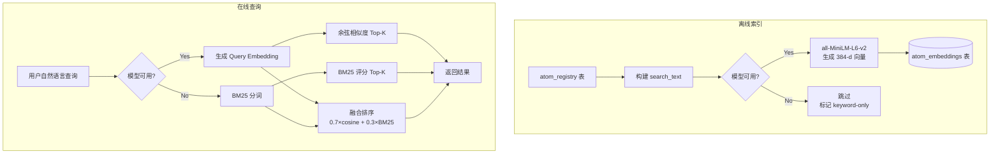

# M5 能力搜索与匹配 — 架构设计文档

> **状态**: `📐 design-ready`
> **作者**: Arch
> **日期**: 2026-07-18
> **依赖**: M4.3 REST API ✅（设计已就绪）

---

## 1. 需求概述

61 个已注册原子，用户（人或 AI agent）需要根据自然语言描述找到匹配的原子能力，而非依赖精确的 atom_id 记忆。

### 功能需求
- F1: 自然语言语义搜索（"帮我查数据库" → mcp.postgres, mcp.mysql）
- F2: 关键词搜索（BM25 作为 baseline）
- F3: 重建索引（新原子注册后触发）
- F4: 组合推荐（经常一起出现的能力推荐）

### 非功能需求
- N1: Termux 环境可运行（无 GPU、内存 < 2GB）
- N2: 模型加载失败时自动退化至 BM25
- N3: 搜索响应 < 100ms
- N4: 索引构建 < 30s（61 个原子）

---

## 2. 搜索架构



**核心哲学**: 优雅降级。模型不可用时自动回退 BM25，搜索永远可用。

---

## 3. 数据模型

### atom_embeddings 表

```sql
CREATE TABLE IF NOT EXISTS atom_embeddings (
    atom_id        TEXT PRIMARY KEY REFERENCES atom_registry(atom_id),
    search_text    TEXT NOT NULL,            -- 被嵌入的源文本
    embedding      TEXT,                     -- JSON float 数组 [0.1, -0.3, ...]
    model_name     TEXT DEFAULT 'all-MiniLM-L6-v2',
    embedding_dim  INTEGER DEFAULT 384,
    generated_at   TEXT NOT NULL,
    UNIQUE(atom_id, model_name)
);
```

### search_text 构建规则

```
search_text = f"{name}. {description}. {purpose.summary}. 
               Functions: {f1: desc1; f2: desc2; ...}.
               Tags: {tag1, tag2, ...}."
```

示例:
```
Postgres. PostgreSQL database operations. MCP server 'Postgres' extracted from...
Functions: query: Execute SQL query; list_tables: List all tables; ...
Tags: mcp, database, auto-registered.
```

---

## 4. API 契约

### 4.1 语义搜索

```
POST /api/v1/search
Content-Type: application/json

{
  "query": "query a postgres database",
  "top_k": 10,
  "category": "Database",         // 可选: 预过滤
  "maturity": "stable",           // 可选
  "use_semantic": true             // 默认 true
}

Response 200:
{
  "query": "query a postgres database",
  "search_mode": "hybrid",         // "semantic" | "keyword" | "hybrid"
  "model": "all-MiniLM-L6-v2",
  "took_ms": 45,
  "results": [
    {
      "atom_id": "mcp.postgres",
      "name": "Postgres",
      "score": 0.95,
      "matched_functions": [
        {"name": "query", "relevance": 0.92},
        {"name": "list_tables", "relevance": 0.78}
      ],
      "classification": {"category": "Database", "maturity": "stable"}
    },
    {
      "atom_id": "mcp.mysql",
      "name": "Mysql",
      "score": 0.89,
      "matched_functions": [...]
    }
  ]
}
```

**search_mode 语义**:
| 值 | 含义 |
|------|------|
| semantic | MiniLM 模型可用，纯向量搜索 |
| hybrid | MiniLM + BM25 融合排序 |
| keyword | 模型不可用，仅 BM25 |

### 4.2 重建索引

```
POST /api/v1/search/rebuild

Response 200:
{
  "status": "ok",
  "atoms_indexed": 61,
  "model": "all-MiniLM-L6-v2",
  "search_mode": "semantic",
  "took_seconds": 12.5
}

Response 200 (模型不可用):
{
  "status": "ok",
  "atoms_indexed": 61,
  "model": null,
  "search_mode": "keyword",
  "warning": "sentence-transformers not installed; keyword-only search"
}
```

### 4.3 获取搜索状态

```
GET /api/v1/search/status

Response 200:
{
  "search_mode": "semantic",
  "model": "all-MiniLM-L6-v2",
  "embedding_dim": 384,
  "atoms_indexed": 61,
  "last_rebuilt": "2026-07-18T12:00:00Z"
}
```

---

## 5. 模块结构

```
mcp-yuanzi-bridge/
├── search/
│   ├── __init__.py
│   ├── embedder.py             ← 文本 → 向量（MiniLM / fallback）
│   ├── indexer.py              ← 批量索引构建
│   └── ranker.py               ← 余弦相似度 + BM25 融合
├── api/
│   └── routes/
│       └── search.py           ← /api/v1/search 路由
├── migrations/
│   └── 004_atom_embeddings.py  ← 新增迁移
└── registry.py                  ← 已有（复用 list_atoms）
```

---

## 6. 技术选型

| 维度 | 选择 | 理由 |
|------|------|------|
| 嵌入模型 | **all-MiniLM-L6-v2** | 384 维，~90MB，CPU 推理 < 10ms/条，HuggingFace 下载 |
| 向量存储 | **SQLite TEXT (JSON)** | 61 个 384 维向量 ~ 150KB，无需专用向量数据库 |
| 关键词 | **BM25** | scikit-learn TfidfVectorizer 或自实现，零额外依赖 |
| Python 库 | sentence-transformers (可选) | 安装失败时自动退化至 BM25 |

---

## 7. 实施子任务

| # | 任务 | 依赖 | 预估 |
|---|------|------|------|
| M5.1a | 迁移 004: atom_embeddings 表 | M4.1 ✅ | 15 min |
| M5.1b | search/embedder.py | 无 | 1h |
| M5.1c | search/indexer.py | M5.1a,b | 30 min |
| M5.1d | search/ranker.py (BM25 + cosine) | 无 | 1h |
| M5.2a | api/routes/search.py | M5.1d, M4.3 | 45 min |
| M5.2b | 集成测试 | M5.2a | 30 min |

---

## 8. 验证方案

```bash
# 重建索引
curl -X POST http://127.0.0.1:8081/api/v1/search/rebuild

# 语义搜索
curl -X POST http://127.0.0.1:8081/api/v1/search \
  -H 'Content-Type: application/json' \
  -d '{"query": "help me with database queries"}'

# 关键词模式（显示指定）
curl -X POST http://127.0.0.1:8081/api/v1/search \
  -H 'Content-Type: application/json' \
  -d '{"query": "database", "use_semantic": false}'

# 查看搜索状态
curl http://127.0.0.1:8081/api/v1/search/status
```

---

## 9. 边界条件

| 场景 | 行为 |
|------|------|
| 模型未安装 | 自动退化 BM25，search_mode="keyword" |
| 索引为空 | 返回空列表，提示"run rebuild first" |
| 查询为空字符串 | 400 Bad Request |
| 61 个原子全部匹配 | top_k 截断 |
| 注册新原子后 | 需手动/自动调用 rebuild（后续可加 hook） |

---

> 📐 **design-ready** — 方案设计完成，与 M4 方案可并行或串行实施。
