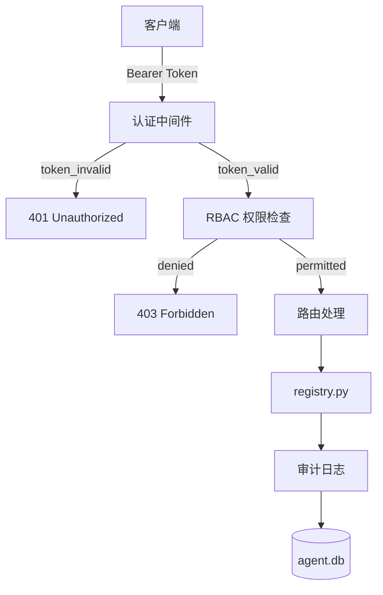

# M6 安全与多租户 — 架构设计文档

> **状态**: `✅ 已实现`（代码领先文档，以代码为准）— 状态刷新于 2026-07-19
> **作者**: Arch
> **日期**: 2026-07-18
> **前置**: M4.3 REST API ✅（但需按本设计加固）
> **关联**: Audit #1 (BUG-007/008/020) · Audit #2 (BUG-023/024/025)

> ⚠️ **实现状态横幅（2026-07-19）**：主体已全部落地且测试全绿——`auth.py` RBAC 四级角色、`/tokens` CRUD、probe scheme+CIDR 白名单、content_hash 物理列+查重+回填、`/audit/verify` 哈希链校验、base-atom 路径沙箱与 SSRF 防护均在代码中。阅读时以 `mcp-yuanzi-bridge/auth.py` / `registry.py` / `api.py` 为准。主要偏差点：
> 1. **文档自身迁移编号打架**：§4 称审计链为迁移 006、§6 子任务表称 007；代码实际 005=content_hash、006=api_tokens、008=audit_chain。
> 2. 威胁表"14 个路由"已过时：`api.py` 现 39 个路由（含 workflow/federation/marketplace）。
> 3. token 存储设计仍写 `registry_meta`，代码已废弃该表，实际为 `api_tokens` 表（迁移 006）。
> 4. **开发模式（无 token 全放行）仍是默认**：仓库内启动脚本均不设置 `YUANZI_API_TOKEN`，安全性依赖部署方自觉。
> 5. 读路由实际全员强制 Bearer（仅 `/health` 豁免），"读路由可选认证"的旧口径作废（BUG-038 备档）。

---

## 1. 背景

Audit 两次审查发现严重安全问题：

| BUG | 严重度 | 描述 |
|-----|--------|------|
| BUG-025 | 🔴 P0 | REST API 14 个路由零认证，含 5 个写路由。任何可达端口的调用方可自审自批、改状态、回滚 |
| BUG-020 | 🔴 P0 | probe 无 scheme 白名单，注册数据若来自不可信导入，批量探测即内网扫描器 |
| BUG-007/008 | 🔴 P0 | atom-file-read 任意文件读取 / atom-http-get SSRF 仍 Open |
| BUG-016 | ⛔ P1 | content_hash 只写内存不落库，能力去重形同虚设 |
| BUG-024 | ⛔ P1 | probe_atom 被桥接提交回退为功能桩，丢失完整语义 |

当前 main 分支 **30 个测试失败，CI 红灯**，门禁形同虚设。

---

## 2. 威胁模型

```
攻击面分析:

┌─────────────────────────────────────────────────────┐
│  攻击向量                  当前防护   风险         │
├─────────────────────────────────────────────────────┤
│  POST /atoms              无认证     P0 任意注册   │
│  POST /atoms/{id}/review  无认证     P0 自审自批   │
│  POST /atoms/{id}/status  无认证     P0 任意改状态 │
│  POST /atoms/{id}/rollback 无认证    P0 任意回滚   │
│  POST /atoms/{id}/probe   无认证+P1  P0 SSRF+内网扫描│
│  GET /atoms               无认证     P2 信息泄露   │
│  atom-file-read handler   无限制     P0 任意文件读取│
│  atom-http-get handler    无限制     P0 SSRF       │
│  agent.db 文件权限        依赖OS     P1 本地篡改   │
└─────────────────────────────────────────────────────┘
```

信任边界：API 服务监听 `127.0.0.1:8081`，但 Termux 内其他应用、adb forward、以及未来可能的局域网暴露都构成威胁。

---

## 3. 安全架构



### 3.1 认证层：API Key + Bearer Token

**设计决策**: 使用静态 API Key（Bearer Token），不引入 OAuth/JWT 复杂度。
Termux 本地环境不需要完整的 OAuth 流程；一个预共享密钥足够。

```
每个请求携带:
  Authorization: Bearer <token>

token 来源（优先级）:
  1. 环境变量 YUANZI_API_TOKEN（Termux 启动脚本设置）
  2. agent.db 中 registry_meta 表 key='api_token'
  3. 若两者皆空 → 开发模式，允许所有请求（打印警告日志）
```

**中间件伪契约**:
```python
# api.py 新增
from fastapi import Depends, HTTPException, Security
from fastapi.security import HTTPBearer

security = HTTPBearer(auto_error=False)

def verify_token(credentials = Security(security)) -> str:
    """返回认证主体标识，失败抛 401。"""
    if not credentials:
        if TOKEN is None:  # 开发模式
            return "anonymous"
        raise HTTPException(401, "Missing Bearer token")
    if not secrets.compare_digest(credentials.credentials, TOKEN):
        raise HTTPException(401, "Invalid token")
    return "authenticated"
```

### 3.2 RBAC 权限模型

**角色定义**:

| 角色 | 权限 | 说明 |
|------|------|------|
| `admin` | 全部读写 | 人类操作者 |
| `registry` | 读 + submit + status | 自动化注册流程 |
| `viewer` | 只读 | 查询/统计/健康检查 |
| `probe` | 只读 + probe | 健康探测专用 |

**路由权限映射**:

```
GET  /health, /stats, /atoms, /atoms/{id}    → viewer+
GET  /atoms/{id}/versions                      → viewer+
POST /atoms                                    → registry+
POST /atoms/{id}/status                        → registry+
POST /atoms/{id}/review                        → admin
POST /atoms/{id}/rollback                      → admin
POST /atoms/{id}/probe                         → probe+
POST /search, /search/rebuild                  → viewer+
```

实现：一个 `require_role(*roles)` 依赖函数，注入到路由。

### 3.3 Probe 安全加固

**问题**: `probe_atom` 对注册表中的任意 URL 发起真实 HTTP 请求。

**加固策略**:

```
probe 允许的 URL scheme 白名单:
  ✅ http
  ✅ https
  ❌ file://   → 拒绝
  ❌ gopher:// → 拒绝
  ❌ dict://   → 拒绝
  ❌ 所有其他   → 拒绝

probe 允许的目标地址:
  ✅ 127.0.0.0/8     (localhost)
  ✅ ::1             (IPv6 localhost)
  ❌ 10.0.0.0/8      → 拒绝（或可配置）
  ❌ 172.16.0.0/12   → 拒绝
  ❌ 192.168.0.0/16  → 拒绝（或可配置）
  ❌ 公网 IP          → 拒绝（或可配置）
```

配置项在 `registry_meta` 或环境变量中：
```
YUANZI_PROBE_ALLOWED_CIDR=127.0.0.0/8,192.168.1.0/24
```

### 3.4 原子签名验证

**问题**: BUG-016 — content_hash 只写内存不落库，能力去重形同虚设。

**DDL 修复**（应在 `atom_registry` 表中添加物理列）:
```sql
-- 迁移 005: 确保 content_hash/identity_hash 物理列存在
ALTER TABLE atom_registry ADD COLUMN content_hash TEXT;
ALTER TABLE atom_registry ADD COLUMN identity_hash TEXT;

-- 回填已有数据
UPDATE atom_registry SET
  content_hash = json_extract(signature_json, '$.content_hash'),
  identity_hash = json_extract(signature_json, '$.identity_hash');
```

注册逻辑修复：
- `submit_atom` 必须将 `content_hash` 和 `identity_hash` 写入主表物理列
- 注册前检查 `content_hash` 是否已存在，若存在 → 返回 `duplicate_signature`
- `compute_signature` 仍基于 `content + identity` 组合

### 3.5 审计哈希链

**问题**: 审计日志存储在 SQLite 中，管理员可篡改。

**设计**: 每行审计日志包含前一行的 SHA-256 哈希，形成防篡改链。

```
atom_audit_log 新增字段:
  chain_hash TEXT  -- SHA-256(prev_chain_hash + current_row_json)

验证方式:
  从头遍历审计表，重算 chain_hash，若某行不符 → 检测到篡改
```

验证接口：
```
GET /api/v1/audit/verify
→ {"valid": true, "total_rows": 1203, "verified_at": "..."}
→ {"valid": false, "broken_at_row": 587, "expected": "...", "actual": "..."}
```

### 3.6 atom-file-read / atom-http-get 沙箱

**问题**: BUG-007/008 — 示例原子可被利用进行任意文件读取和 SSRF。

**加固策略**:

```
atom-file-read:
  ✅ 路径必须在白名单目录内（默认: /data/data/com.termux/files/home/yuanzi-data/）
  ❌ 拒绝绝对路径 ../ 穿越
  ❌ 拒绝符号链接

atom-http-get:
  ✅ URL scheme 白名单: http, https
  ❌ 拒绝内网地址（可配置）
  ✅ 响应体大小限制: 默认 100KB
  ✅ 超时: 默认 10s
```

这些约束应写入原子的 `compliance` 字段，由 `registry.py` 在 submit 时校验。

---

## 4. 数据模型变更

### 新增表: `api_tokens`

```sql
CREATE TABLE IF NOT EXISTS api_tokens (
    id          INTEGER PRIMARY KEY AUTOINCREMENT,
    token_hash  TEXT UNIQUE NOT NULL,      -- SHA-256(token)
    description TEXT,                       -- "CLI automation"
    role        TEXT NOT NULL DEFAULT 'viewer',  -- admin/registry/viewer/probe
    created_by  TEXT,
    created_at  TEXT NOT NULL,
    expires_at  TEXT,                       -- NULL = 永不过期
    revoked_at  TEXT                        -- NULL = 有效
);
```

### 修改表: `atom_registry`

```sql
-- 迁移 005: 物理 content_hash/identity_hash 列
ALTER TABLE atom_registry ADD COLUMN content_hash TEXT;
ALTER TABLE atom_registry ADD COLUMN identity_hash TEXT;
```

### 修改表: `atom_audit_log`

```sql
-- 迁移 006: 审计哈希链
ALTER TABLE atom_audit_log ADD COLUMN chain_hash TEXT;
```

---

## 5. API 契约变更

### 5.1 所有请求（认证头）

```
Authorization: Bearer <token>
```

### 5.2 Token 管理（admin only）

```
POST   /api/v1/tokens              # 创建 token
GET    /api/v1/tokens               # 列出 tokens（不含完整值）
DELETE /api/v1/tokens/{id}          # 吊销 token
```

### 5.3 审计验证

```
GET /api/v1/audit/verify            # 验证审计链完整性
```

---

## 6. 实施子任务

| # | 任务 | 优先级 | 说明 |
|---|------|--------|------|
| M6.1a | 认证中间件 `api/auth.py` | P0 | Bearer Token 验证，开发模式退化 |
| M6.1b | Token 管理路由 | P0 | CRUD + `api_tokens` 表迁移(005) |
| M6.2a | RBAC 依赖注入 `require_role()` | P1 | admin/registry/viewer/probe 四级 |
| M6.2b | 路由权限绑定 | P1 | 14 个路由绑定对应角色 |
| M6.3a | `content_hash`/`identity_hash` 物理列 | P1 | 迁移(006) + 回填 + 去重检查 |
| M6.3b | `submit_atom` 能力去重修复 | P1 | content_hash 查重 → duplicate_signature |
| M6.4a | 审计哈希链 | P2 | 迁移(007) + chain_hash 写入 + 验证端点 |
| M6.4b | 审计验证 API | P2 | GET /audit/verify |
| M6.5a | probe scheme 白名单 | P0 | 仅 http/https，拒绝 file:// 等 |
| M6.5b | probe CIDR 限制 | P0 | 默认仅 127.0.0.0/8，可配置 |
| M6.6a | atom-file-read 路径沙箱 | P1 | 白名单目录，防穿越 |
| M6.6b | atom-http-get SSRF 防护 | P1 | scheme 白名单 + 内网拒绝 + 响应限制 |

---

## 7. 验证方案

```bash
# 1. 无 token 请求 → 401
curl http://127.0.0.1:8081/api/v1/atoms
# → 401 {"detail": "Missing Bearer token"}

# 2. 有 token 读请求 → 200
curl -H "Authorization: Bearer $YUANZI_TOKEN" http://127.0.0.1:8081/api/v1/atoms
# → 200

# 3. viewer token 写请求 → 403
curl -X POST -H "Authorization: Bearer $VIEWER_TOKEN" \
  http://127.0.0.1:8081/api/v1/atoms -d '{}'
# → 403 {"detail": "Requires admin or registry role"}

# 4. probe SSRF 防护
python -c "from registry import probe_atom; \
  atom = {'runtime': {'endpoint': 'file:///etc/passwd'}}; \
  print(probe_atom(None, 'test', atom))"
# → {"ok": false, "error": "scheme 'file' not allowed"}

# 5. 审计链验证
curl -H "Authorization: Bearer $ADMIN_TOKEN" \
  http://127.0.0.1:8081/api/v1/audit/verify
# → {"valid": true, "total_rows": 1203}

# 6. 能力去重
# 注册两个 content_hash 相同的原子 → 第二个返回 duplicate_signature
```

---

> 📐 **design-ready** — M6 安全架构方案完成。解决了 Audit #1/#2 中 BUG-007/008/020/025/016。
> 预计工期: 9 个子任务，~5 天。
